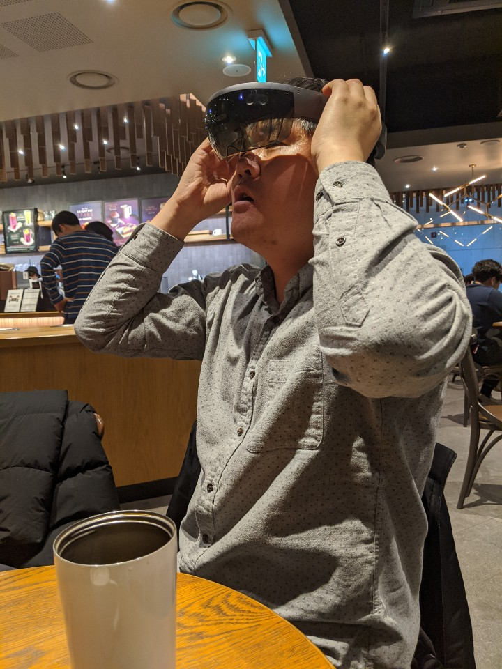
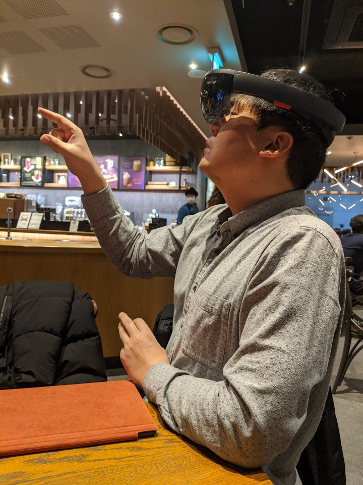

# 미팅 기록

## 윤우님 문제 다시 리뷰

- Client
  - 기간별 전체 리스트를 서버에 요청
  - 그 기간에 맞는 전체 동물 정보를 **모두** 얻어옴
- Server
  - 동물보호관리시스템 API 호출을 두번 함
  - 첫 번째 호출: totalCount 값을 얻어와 그 갯수만큼의 list를 다시 얻음
  - 두 번째 호출: totalCount 값 만큼의 list를 얻고 client에 전달

## 코드 리뷰

- async, await 사용
- router.get() 호출 시 두번 째 파라미터에 async 사용 가능
- [https://github.com/henyy1004/nyangterest/pull/113](https://github.com/henyy1004/nyangterest/pull/113)

## 비동기 처리에 대한 이해

- 콜백은 왜 필요한가?
- async, await를 사용하는 것과 Promise.then을 호출하는 것의 큰 차이
- 이 차이점을 이해하지 못하면 비동기 흐름에 대해 설명하지 못함

## 더 자세하게 공부해보기

- 기본 단위인 스레드 공부하기
- 스레드는 시작, 우선순위, 종료시 콜백 받기 밖에 제어를 못함
- 이런 스레드가 여러개가 돌면 어떻게 관리해야 하는지에 대한 기법 이해
  - 안타깝게도 자바스크립트에는 없음 ㅜㅜ
  - Java, C#, C++ 등과 같은 언어에서 힌트를 얻고 공부

## 20번째 미팅 기념 책 선물 전달

- 심플 소프트웨어를 선물로 드려요
- 미리 얘기했듯이 e-book 형태로 드립니다.
- 인터파크 도서에서 산 책이므로 비스킷 앱을 설치하셔서 보세요.
- 사진을 찍지 못했는데, 윤우님이 제가 홀로렌즈 쓴 사진을 찍어 주셔서 그 사진으로 대체합니다.
- 
- 